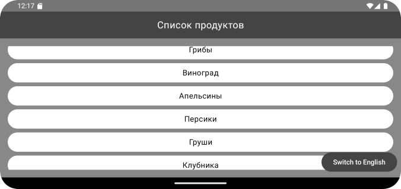

# Домашнее задание по теме "State. Сохранение состояния компонентов экрана"

## State. Сохранение состояния компонентов экрана

На основе пройденного материала необходимо написать приложение для вывода списка продуктов с возможностью переключения языка с русского на английский и обратно. Переключение производится после нажатия на элемент «Switch language». Вид компонентов должен моментально обновляться. При изменении ориентации экрана состояние компонентов должно сохраняться.
Конечный результат должен выглядеть примерно так:

Приложение необходимо сохранить проектом в удаленном репозитории, для проверки качества предоставить ссылку преподавателю, либо сделать скрины эмулятора при каждом шаге работы приложения или снять видео экрана при работе приложения.

## Скриншоты домашнего задания о теме "State. Сохранение состояния компонентов экрана"

